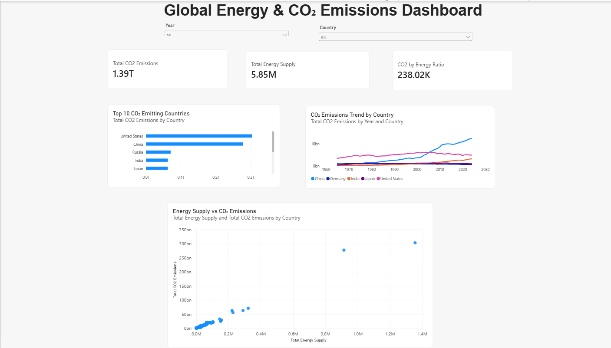

# Global Energy & CO₂ Emissions Analysis

An end-to-end data analytics project exploring global CO₂ emissions
and energy supply using MySQL and Power BI.

## Dashboard



## Project Overview

This project analyzes historical CO₂ emissions and energy supply
across countries to identify major emitters, examine long-term
emission trends, and explore the relationship between energy supply
and CO₂ emissions.

The project follows an end-to-end analytics workflow:

CSV Data → MySQL → SQL Analysis → Power BI → DAX → Dashboard


## Tools Used

- MySQL
- MySQL Workbench
- SQL
- Power BI Desktop
- Power Query
- DAX


## Data Preparation

Two datasets containing historical CO₂ emissions and energy supply
were imported into MySQL.

The datasets were validated for missing values and duplicates before
being joined using country, country code, and year.

A SQL view called `vw_energy_emissions` was created as the analytical
data source for Power BI.


## SQL Analysis

The SQL analysis includes:

- Data validation
- Missing-value checks
- Duplicate detection
- INNER JOIN operations
- Historical trend analysis
- Top emitter analysis
- Energy vs CO₂ comparison
- CO₂/Energy ratio calculation


## Power BI Dashboard

The interactive Power BI report includes:

- Total CO₂ Emissions KPI
- Total Energy Supply KPI
- CO₂/Energy Ratio KPI
- Year slicer
- Country slicer
- Top 10 CO₂ emitting countries
- Historical CO₂ emissions trends
- Energy Supply vs CO₂ scatter analysis

Regional and income-group aggregates were separated from countries
to avoid misleading country rankings.


## Data Model

The two source tables were joined using:

- Country
- Country Code
- Year

The resulting SQL view was imported into Power BI for analysis.


## DAX Measures

Key measures include:

### Total CO₂ Emissions

```DAX
Total CO2 Emissions =
SUM('Energy Emissions'[CO2 Emissions])

### Total Energy Supply
Total Energy Supply =
SUM('Energy Emissions'[Energy Supply])


### CO2 by Energy ratio

CO2 by Energy Ratio =
DIVIDE(
    [Total CO2 Emissions],
    [Total Energy Supply],
    0
)

### Dashboard Features

The dashboard allows users to:

Filter analysis by year
Compare selected countries
Identify leading CO₂ emitters
Analyze historical emission trends
Explore the relationship between energy supply and emissions


